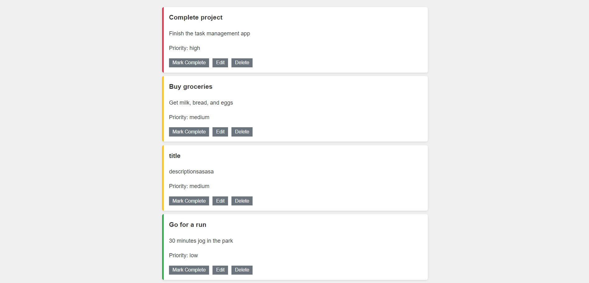
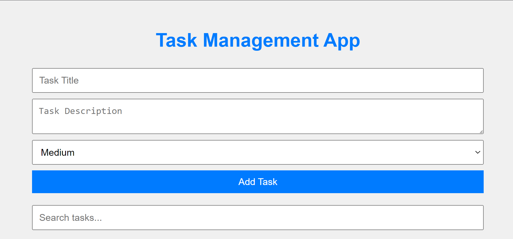
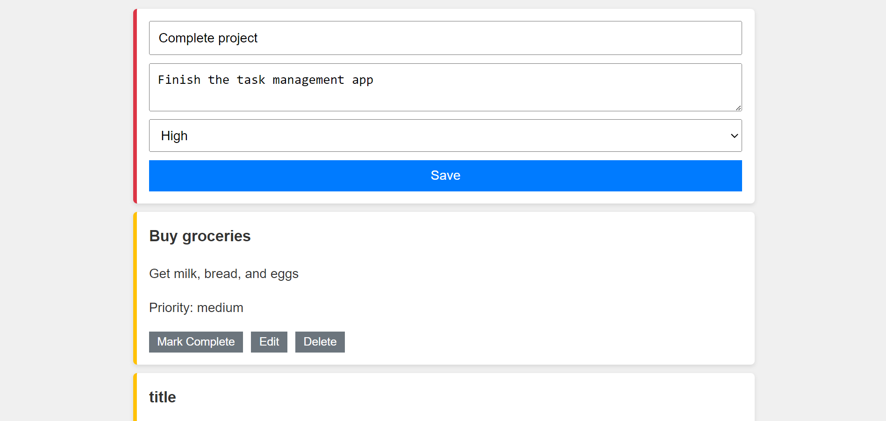

# Task Management App

[](https://opensource.org/licenses/MIT)

A simple, responsive task management application built with Next.js and React. Manage your tasks efficiently with features like priority-based sorting and persistent storage.

## 🚀 Features

- [x] Add, edit, and delete tasks
- [x] Mark tasks as completed
- [x] Automatic sorting of tasks by priority
- [x] Persistent storage using localStorage
- [x] Server-side rendering for initial load
- [x] Responsive design

## 📸 Screenshots

<details>
<summary>Click to view screenshots</summary>

### Task List



### Add Task



### Edit Task



</details>

## 🛠️ Setup Instructions

1. Clone the repository:

   ```bash
   git clone https://github.com/lokendra-singh-rao/task-management.git
   cd task-management-app
   ```

2. Install dependencies:

   ```bash
   npm install
   ```

3. Run the development server:

   ```bash
   npm run dev
   ```

4. Open [http://localhost:3000](http://localhost:3000) with your browser to see the result.

## 🧠 Approach for Sorting Tasks by Priority

We implement task sorting using a custom function in `utils/taskUtils.js`:

1. Tasks are first sorted by completion status (incomplete before complete).
2. Within each completion group, tasks are sorted by priority.
3. Priority order: High > Medium > Low.

<details>
<summary>View sorting function</summary>

```javascript
const priorityOrder = { high: 1, medium: 2, low: 3 };

export function sortTasks(tasks) {
  return tasks.sort((a, b) => {
    if (a.completed !== b.completed) {
      return a.completed ? 1 : -1;
    }
    return priorityOrder[a.priority] - priorityOrder[b.priority];
  });
}
```

</details>

This sorting is applied whenever tasks are added, updated, or toggled as complete.

## 🛠️ Technologies Used

- Next.js
- React
- CSS for styling
- localStorage for data persistence

## 🤝 Contributing

Contributions, issues, and feature requests are welcome! Feel free to check [issues page](https://github.com/lokendra-singh-rao/task-management/issues).

## 📝 License

This project is [MIT](https://opensource.org/licenses/MIT) licensed.

---

<div align="center">

Made with ❤️ by [Lokendra Singh Rao]

</div>
